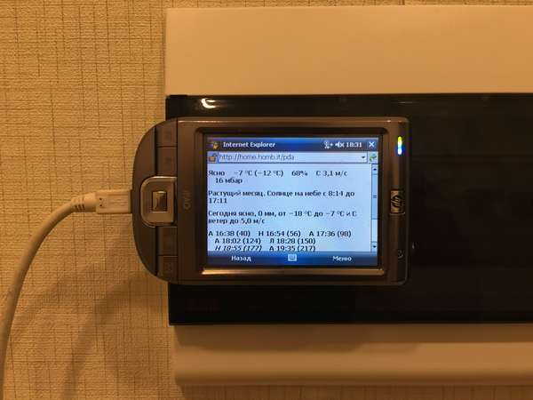

# `House`
## Weather and train schedule monitor for PDA installed on the wall in my home.

Webserver provides a page with:
 * current weather;
 * one day weather forecast, for today before 7pm and for tomorrow after 7pm;
 * phase of moon, time of sunset and sunrise;
 * train schedule from my station to the centre, italic font shows trains that don't stop on the station where I alight from time to time.